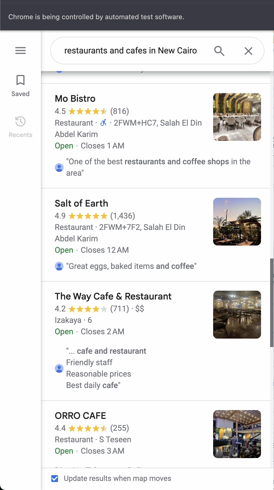
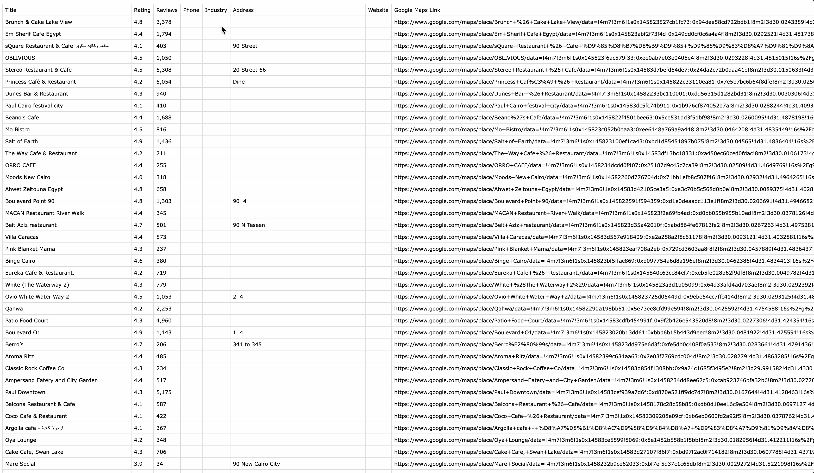
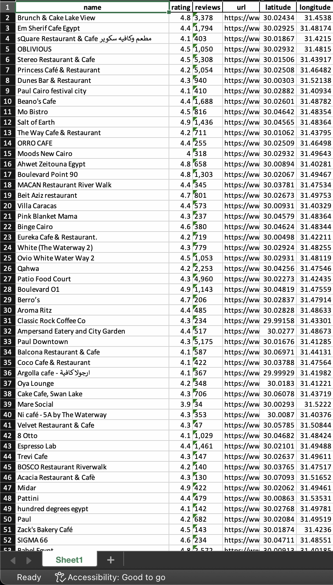

<a id="readme-top"></a>


<!-- PROJECT SHIELDS -->
<!--
*** I'm using markdown "reference style" links for readability.
*** Reference links are enclosed in brackets [ ] instead of parentheses ( ).
*** See the bottom of this document for the declaration of the reference variables
*** for contributors-url, forks-url, etc. This is an optional, concise syntax you may use.
*** https://www.markdownguide.org/basic-syntax/#reference-style-links
-->


<!-- PROJECT LOGO -->
<br />
<div align="center">
  <a href="https://github.com/othneildrew/Best-README-Template">
    
  </a>

  <h3 align="center">Automated google maps scraper</h3>

  <p align="center">
    Mainstream your scraping process
    <br />
  </p>
</div>

<!-- ABOUT THE PROJECT -->
## About The Project

This project integrates an open-source JavaScript scraper with a **Python** script to automate data extraction from **Google Maps** using Selenium. The tool is designed to efficiently gather information such as names, addresses, and ratings of restaurants and cafes. By automating the scraping process, the project simplifies data collection for analysis and research, ensuring reliable performance with robust error handling.


<!-- GETTING STARTED -->
## Getting Started

To set up the automated Google Maps scraper, follow these steps:

### Prerequisites

`Python`  Make sure you have Python installed on your system. You can download it from [here](https://www.google.com/search?client=safari&rls=en&q=python+download&ie=UTF-8&oe=UTF-8)
<br>
`Google Chrome` Ensure you have the latest version of Google Chrome installed from [here](https://www.google.com/chrome/).
 

### Installation


1. First, clone the repository to your local machine using the following command:
```sh
git clone https://github.com/Omar88magdy/Automated-google-maps-scraping-
   ```

2. Download [chrome driver](https://googlechromelabs.github.io/chrome-for-testing/) that matches you chrome version
  ```sh
cd Downloads
ls Downloads
  ```

3. Navigate to the direcory
  ```sh
cd Automated-google-maps-scraping-
   ```
 
4. Install the required packages 
  ```sh
pip install -r requirements.txt
   ```   
5. Change `chrome_driver_path` variable to the location for `chrome driver`

6. Open `script.py` and modify the `search_query` variable then run the script 
 ```sh
python script.py
 ```


<!-- USAGE EXAMPLES -->
## Usage
 Walkthrough the usage:
<br>
* After running the script directly chrome will open and googlemaps will start searching by your search query 
<br>

<p align="center">
  
</p>

<!--    -->

* Search results will start showing up and the automated scrolling will start scrolling 

<p align="center">
  
</p>

  
* A `google_maps_data.csv` file will be generated in the directory containing the scraped data
<p align="center">
  
</p>

* A `search_query.xlsx` file will be generated after doing some cleaning and renaming procedures
<br>

**containing**

    - Name
    - Review stars rating
    - Reviews count
    - Google maps url
    - location(lat, lon)
    
  <p align="center">
  
</p>


## Refrences 
link for [Extension](https://www.youtube.com/watch?v=8VckTa1Wgwc&t=492s)
## Contact

Omar Magdy - [Linkedin](https://www.linkedin.com/in/omar-magdy-197a88215/) - omar_898@icloud.com


